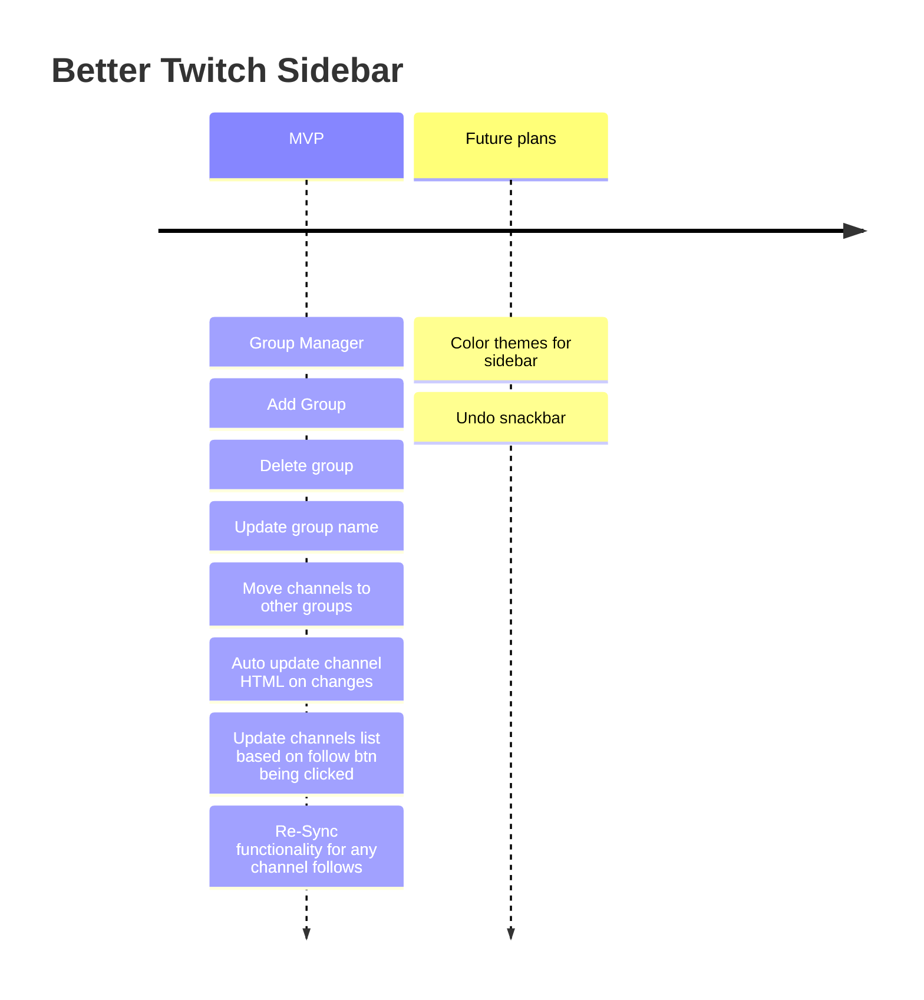

<h1> Chrome Extension For Replacing  Twitch's Followed Channels Sidebar Section</h1>

## Table of Contents

- [Intro](#intro)
- [Preview](#preview)
- [Features](#features)
  - [Timeline](#timeline)
- [Usage](#usage)
  - [Setup](#setup) 
- [Tech Docs](#tech)
- [Contributing](#contributing)

## Intro 
I've always disliked the existing Twitch sidebar for viewing the channels you follow. It seems to promote the higher viewed channels and with a more recent addition "recommended channels" which i believe only shows recently watched channels...

The goal of this project is to provide a more user friendly means of viewing your followed channels. This includes allowing for the ability to manage groups of followed channels, move channels around and add/delete groups, and more to come.

> Chrome does not accept manifest v2 extensions since Jan 2022, therefore this template uses manifest v3.

> Firefox + other browsers don't yet support manifest v3, so cross browser usage is not encouraged.

* Read more about Chrome manifest v2 support [here](https://developer.chrome.com/docs/extensions/mv2/).
* Read more about Firefox Manifest v3 support [here](https://discourse.mozilla.org/t/manifest-v3/94564).

As soon as Firefox supports manifest v3, support will be added in this repo as well.

## Preview 

Current Twitch Sidebar

https://github.com/clgerhardt/better-twitch-sidebar-extension/assets/22062735/13ff32b8-be18-4114-b4c3-b7d5046a05c3

Better Twitch Sidebar!🥳

https://github.com/clgerhardt/better-twitch-sidebar-extension/assets/22062735/ebdfef1a-7c7c-455b-b7fd-7a97a73c7480

## Features 
- [React 18](https://reactjs.org/)
- [TypeScript](https://www.typescriptlang.org/)
- [Tailwind CSS](https://tailwindcss.com/)
- [ESLint](https://eslint.org/)
- [Chrome Extension Manifest Version 3](https://developer.chrome.com/docs/extensions/mv3/intro/)
- [Github Action](https://github.com/JohnBra/vite-web-extension/actions/workflows/ci.yml) to build and zip your extension (manual trigger)

### Timeline 

## Usage 

### Setup 
1. Clone this repository
3. Run `yarn` or `npm i` (check your node version >= 16)
4. Run `yarn dev` or `npm run dev`
5. Load Extension in Chrome
   1. Open - Chrome browser
   2. Access - chrome://extensions
   3. Tick - Developer mode
   4. Find - Load unpacked extension
   5. Select - `dist` folder in this project (after dev or build)
6. If you want to build in production, Just run `yarn build` or `npm run build`.

Testing:
1. `yarn test` or `npm run test`
2. `yarn coverage` or `npm run coverage`

Additional Notes For Running:

`.env` configurations
if you don't have one already - add `.env` file to the root of the project

Currently there are 3 env properties:
- VITE_LOGGER_LEVEL: string
  - e.g., "debug"
- VITE_USE_MOCK: boolean
  - true or false
- VITE_MOCK_FILE: string - required if VITE_USE_MOCK is true
  - version of mock corresponding to end of file name for mocks in /src/pages/mock
  - e.g., "v2"

### Publishing
To upload an extension to the Chrome store you have to pack (zip) it and then upload it to your item in entry 
in the Chrome Web Store.

This repo includes a Github Action Workflow to create a 
[optimized prod build and create the zip file](https://github.com/JohnBra/vite-web-extension/actions/workflows/ci.yml).

To run the workflow do the following:
1. Go to the **"Actions"** tab in your forked repository from this template
2. In the left sidebar click on **"Build and Zip Extension"**
3. Click on **"Run Workflow"** and select the main branch, then **"Run Workflow"**
4. Refresh the page and click the most recent run
5. In the summary page **"Artifacts"** section click on the generated **"vite-web-extension"**
6. Upload this file to the Chrome Web Store as described [here](https://developer.chrome.com/docs/webstore/publish/)

# Tech Docs 
- [Vite](https://vitejs.dev/)
- [Vite Plugin](https://vitejs.dev/guide/api-plugin.html)
- [Chrome Extension with manifest 3](https://developer.chrome.com/docs/extensions/mv3/)
- [Rollup](https://rollupjs.org/guide/en/)
- [@crxjs/vite-plugin](https://crxjs.dev/vite-plugin)
- [Tailwind CSS](https://tailwindcss.com/docs/configuration)

# Contributing 
Feel free to open PRs or raise issues!
